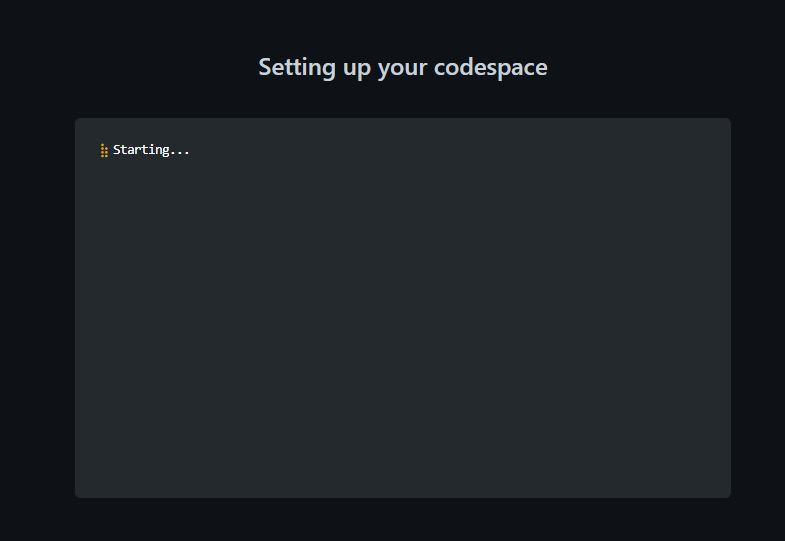
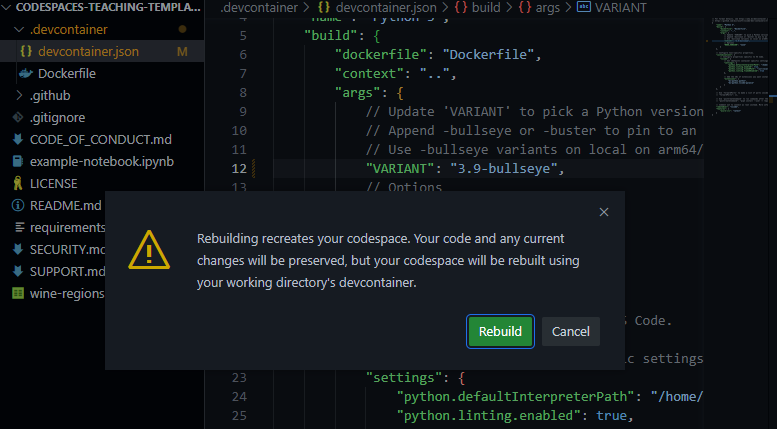

[](https://github.com/codespaces/new?hide_repo_select=true&ref=main&repo=526669888)

# Plantilla de Python en Codespaces

_Crea o amplía un repositorio listo para usarse en la enseñanza de Python en minutos_

* **¿A quién va dirigido?** _Educadores de todos los niveles_. 
* **¿Cuánta experiencia necesitan los estudiantes?** _Ninguna experiencia previa_. Esta plantilla está construida con elementos básicos con comentarios para que pueda utilizarse en lecciones de principiantes a avanzados.
* **Prerrequisitos:** _Ninguno_. Esta plantilla proporciona un Jupyter Notebook funcional con Pandas que utiliza un conjunto de datos para que puedas comenzar a analizar datos de inmediato, así como un Notebook de ejemplo que puedes utilizar para enseñar Python con [GitHub Copilot](https://copilot.github.com), una poderosa herramienta de IA que puede ayudarte a escribir código más rápido.

Con esta plantilla puedes crear rápidamente un entorno normalizado para enseñar o aprender Python. Haz que tus estudiantes se centren en su aprendizaje en lugar de configurar su entorno. Esta plantilla utiliza Codespaces, un entorno de desarrollo alojado en la nube con [Visual Studio Code](https://visualstudio.microsoft.com/?WT.mc_id=academic-77460-alfredodeza), un poderoso editor de texto.

Tú también tendrás la oportunidad de probar Copilot para crear un plan de clase utilizando el archivo [example-lesson.ipynb](./example-lesson.ipynb).

🤔 ¿Curioso? Mira el siguiente vídeo donde te explicamos todos los detalles:

[](https://youtu.be/7rMvb03hHpI "Enseñando Python con Codespaces")

<details>
   <summary><b>🎥 Ve el video tutorial para obtener más información sobre Codespaces</b></summary>
   
   [](https://aka.ms/CodespacesVideoTutorial "Codespaces Tutorial")
</details>

🚀 Características de Codespaces:

- Entorno de nube repetible que ofrece una experiencia increíble.
- Se puede configurar y personalizar.
- Se integra con sus repositorios en GitHub y [VSCode](https://visualstudio.microsoft.com/?WT.mc_id=academic-77460-alfredodeza)

Como profesor, eso significa que puede crear un entorno, en la nube, para que en su clase todos los estudiantes puedan usar una configuración cero o casi nula, independientemente del sistema operativo que estén utilizando.

## 🧑‍🏫 ¿Qué es GitHub Codespace y cómo puedo usarlo en mi enseñanza?

Un Codespace es un entorno de desarrollo alojado en la nube que puede configurar. El beneficio Codespaces Education ofrece a los profesores de Global Campus una asignación mensual gratuita de horas de GitHub Codespaces para usar en [GitHub Classroom](classroom.github.com). Obten más información [aquí](https://docs.github.com/en/education/manage-coursework-with-github-classroom/integrate-github-classroom-with-an-ide/using-github-codespaces-with-github-classroom) sobre el uso de GitHub Codespaces con GitHub Classroom.

Si aún no eres profesor de Global Campus, aplica [aquí](https://education.github.com/discount_requests/pack_application) o para obtener más información, consulta [Aplicar a GitHub Global Campus como profesor](https://docs.github.com/en/education/explore-the-benefits-of-teaching-and-learning-with-github-education/github-global-campus-for-teachers/apply-to-github-global-campus-as-a-teacher).

## Personalización

Personaliza tu proyecto para GitHub Codespaces al confirmar archivos de configuración en tu repositorio (a menudo conocido como _Configuration-as-Code_), lo que crea una configuración repetible de Codespaces para todos los usuarios de tu proyecto.

Puedes configurar cosas como:

- Extensiones, puedes especificar qué extensiones deben estar preinstaladas.
- Dotfiles y configuraciones.
- Bibliotecas del sistema operativo y dependencias.

> 💡 Más información sobre [personalización y configuración en la documentación oficial](https://docs.github.com/en/codespaces/customizing-your-codespace/personalizing-github-codespaces-for-your-account)


## Plantilla de Codespaces

Este repositorio es una plantilla de GitHub, la cual contiene lo siguiente:

- [example-notebook.ipynb](./example-notebook.ipynb): Un notebook que utiliza la librería [Pandas](https://pandas.pydata.org/) para enseñar operaciones básicas con un pequeño archivo CSV (_Comma Separated Value_) [dataset](./wine-regions.csv)
- [.devcontainer/Dockerfile](../../.devcontainer/Dockerfile): Archivo de configuración usado por Codespaces para determinar el sistema operativo y otros detalles.
- [.devcontainer/devcontainer.json](../../.devcontainer/devcontainer.json): Un archivo de configuración utilizado por Codespaces para configurar [Visual Studio Code](https://visualstudio.microsoft.com/?WT.mc_id=academic-77460-alfredodeza), por ejemplo, para agregar y habilitar extensiones adicionales.
- `README.md`. Este archivo describe este repositorio y lo que contiene.

## 🧐 ¡Pruébalo!

Prueba este repositorio de plantillas con Codespaces siguiendo estos pasos:

1. Crea un repositorio desde esta plantilla. Utiliza este [link crea un repositorio](https://github.com/microsoft/codespaces-teaching-template-py/generate). Tú puedes hacer este repositorio privado o público, es tú decisión.
2. Navega a la página principal del repositorio recién creado.
3. Debajo del nombre del repositorio, usa el menú desplegable Code (Código), y en la pestaña Codespaces, selecciona "Create codespace on main" (Crear Codespace en main).
   
4. Espera mientras GitHub inicializa el Codespace.

   


### Inspecciona el entorno de Codespaces

Lo que tienes en este momento es un entorno preconfigurado donde todos los tiempos de ejecución y bibliotecas que necesitas ya están instalados - esto es una experiencia de configuración cero.

También tienes un Jupyter Notebook que puedes comenzar a usar sin ninguna configuración.

> Este entorno se ejecutará independientemente de si tus estudiantes están en Windows, macOS o Linux.

Abre tu archivo Jupyter Notebook [example-notebook.ipynb](./example-notebook.ipynb) y observa cómo puedes agregar código y ejecutarlo.

## Personaliza tu Codespace

Hagamos cambios en tu entorno. Cubriremos dos desafíos diferentes que es probable que desees hacer:

1. Cambiar la versión de Python instalada
1. Agregar una extensión


### Paso 1: Cambiar el entorno de Python

Digamos que deseas cambiar la versión de Python que está instalada. Esto es algo que puedes controlar.

Abre [.devcontainer/devcontainer.json](./.devcontainer/devcontainer.json) y reemplaza la siguiente sección:

```json
"VARIANT": "3.8-bullseye"
```

con las siguientes instrucciones:

```json
"VARIANT": "3.9-bullseye"
```

Este cambio ordena a Codespaces usar Python 3.9 en lugar de 3.8.

### Paso 2: Añade una extensión

Tu entorno viene con extensiones preinstaladas. Puedes cambiar con qué extensiones comienza tu entorno de Codespaces, a continuación, te indicamos cómo:


1. Abre el archivo [.devcontainer/devcontainer.json](./.devcontainer/devcontainer.json) y busca el siguiente elemento JSON **extensions**:

   ```json
   "extensions": [
    "ms-python.python",
    "ms-python.vscode-pylance"
   ]
   ```

2. Agrega _"ms-python.black-formatter"_ a la lista de extensiones. Debería terminar pareciéndose a lo siguiente:

   ```json
   "extensions": [
    "ms-python.python",
    "ms-python.vscode-pylance",
    "ms-python.black-formatter"
   ]
   ```

   Esa cadena de texto es el identificador único de [Black Formatter](https://marketplace.visualstudio.com/items?itemName=ms-python.black-formatter&WT.mc_id=academic-77460-alfredodeza), una extensión popular para formatear código de Python de acuerdo a las mejores prácticas. Añadiendo el identificador _"ms-python.black-formatter"_ a la lista le hace saber a Codespaces que esta extensión debería ser preinstalada al iniciar.

   Recuerda: Cuando cambies cualquier configuración en el json, aparecerá un cuadro después de guardar.

   

   Haz clic en reconstruir. Espera a que el espacio de código vuelva a generar el entorno de VS Code.

Para encontrar el identificador único de una extensión:

- Ingresa a la página web de la extensión, por ejemplo [https://marketplace.visualstudio.com/items?itemName=ms-python.black-formatter](https://marketplace.visualstudio.com/items?itemName=ms-python.black-formatter&WT.mc_id=academic-77460-alfredodeza)
- Localiza el campo *Unique Identifier* bajo la sección **More info** en tu lado derecho.

## 🤖 Utiliza Copilot para crear una lección para alumnos
GitHub Copilot ya está disponible en GitHub Codespaces. Puedes utilizar Copilot para crear una clase para tus alumnos. Este repositorio incluye la extensión de Copilot para que puedas utilizarla inmediatamente. Asegúrate de que tu cuenta tiene acceso a Copilot. Si no tienes acceso, puedes [solicitar acceso aquí](https://github.com/login?return_to=%2Fgithub-copilot%2Fsignup).

GitHub Copilot es gratis para estudiantes y profesores. [Más información](https://education.github.com/pack/offers). Sigue [estos pasos](https://techcommunity.microsoft.com/t5/educator-developer-blog/qu%C3%A9-es-github-copilot-y-c%C3%B3mo-pueden-los-estudiantes-y-maestros/ba-p/3815760?WT.mc_id=studentamb_118941) para verificar tu afiliación como estudiante o profesor y activar Copilot de forma gratuita.

### Paso 1: Escriba una descripción para su lección
Abra el archivo [example-notebook.ipynb](./example-notebook.ipynb) y escriba una descripción para su clase en la primera celda. Asegúrate de que Copilot está activado haciendo clic en el icono de Copilot en la barra de estado y asegurándote de que has iniciado sesión en GitHub.

Edita la primera celda y empieza a escribir `Para esta lección`. Copilot le sugerirá una descripción para su lección. Seleccione la sugerencia y pulse `Tab` para aceptarla.

La celda debería tener ahora un aspecto similar al siguiente:

```markdown
# Crea una lección usando GitHub Copilot
Para esta lección, utilizarás GitHub Copilot para crear una lección para que los estudiantes aprendan a escribir funciones en Python. Utilizarás Copilot para escribir código, y Copilot para escribir texto.
```

No pasa nada si Copilot no te sugiere una réplica exacta del texto anterior. Puedes editar el texto para hacerlo más adecuado para tu clase.

### Paso 2 Añada pasos a su lección
Añada una nueva celda debajo de la celda de descripción y empiece a escribir `### Paso 1: Activar` para crear un nuevo paso en su clase. Copilot le sugerirá un paso para su lección. Seleccione la sugerencia y pulse `Tab` para aceptarla.

La celda debería tener ahora un aspecto similar al siguiente

```markdown
## Paso 1: Activar GitHub Copilot
Habilita Copilot siguiendo las instrucciones de la [documentación de GitHub Copilot](https://docs.github.com/en/codespaces/developing-with-codespaces/using-codespaces-with-github-copilot). Si eres estudiante, puedes obtener el [GitHub Student Developer Pack](https://education.github.com/pack) de forma gratuita para obtener accesso a Copilot.
```

Sigue añadiendo más pasos y continúa escribiendo para obtener sugerencias más precisas sobre el contenido que te interesa. Por ejemplo, este es un paso que Copilot sugirió para el siguiente paso de la clase:

```markdown
## Paso 3: Crear retos para esta lección
Enseñarás a los alumnos a escribir funciones en Python.
```

Puedes utilizar el ejemplo anterior para ver lo que Copilot puede sugerir y autocompletar. Siéntete libre de añadir tantos pasos como creas necesarios para tu lección.

### Paso 3: Añadir retos de código para los estudiantes
Añada una nueva celda de código debajo del último paso y comience con un comentario en Python que describa el reto. Por ejemplo, puede escribir `# crear un reto para que un alumno escriba una función que devuelva la suma de dos números`. Copilot sugerirá una solución para el reto. Seleccione la sugerencia y pulse `Tab` para aceptarla. Para cada nueva línea, puede pulsar `Return` (o `Enter`) para obtener una nueva sugerencia.

Este es un ejemplo de lo que Copilot sugirió para el reto anterior:

```python
# crear un reto para que un alumno escriba una función que devuelva la suma de dos números
"""
En este reto, escribirás una función que devuelva la suma de dos números.
Usarás la función `sum` para sumar los dos números.
Comienza escribiendo una función que tome dos números como parámetros.
A continuación, utiliza la función `sum` para sumar los dos números.
Finalmente, devuelve la suma de los dos números.
"""
```

De nuevo, puede que su reto no sea exactamente igual al anterior. Puede editar el reto para adaptarlo mejor a su clase.

Crea tantas celdas de código con preguntas de ejemplo para su clase.

### Paso 4: Crea un cuestionario para los alumnos
Añada una nueva celda abajo para escribir Markdown (¡no código!) y empiece escribiendo `#### Quiz`. A continuación, añade un comentario _HTML_ para crear una pregunta de modo que GitHub Copilot entienda qué tipo de cuestionario quieres crear. Por ejemplo, podrías usar algo similar a esto:

```html
<!-- genera un cuestionario de 5 preguntas sobre el uso de funciones Python con una mezcla de argumentos de variable y argumentos de palabra clave -->
```

Es posible que Copilot no te sugiera un cuestionario de inmediato. Si ese es el caso, añade nuevas líneas al comentario y pulsa `Return` (o `Enter`) y empieza a enumerar las preguntas que quieres hacer. Por ejemplo, podrías escribir:

```markdown
1. ¿Cuál es la salida del siguiente código?
```

O si estás buscando una pregunta específica sobre un tema podría ser:

```markdown
2. Cuando creas una función que
```

Copilot sugirió una pregunta usando argumentos variables que es de lo que trata el reto:

```markdown
2. Cuando creas una función que acepta un número variable de argumentos, ¿cómo se llama el parámetro que utilizas para acceder a los argumentos?
```

Por último, revisa las celdas y realiza los cambios necesarios. También puedes añadir más pasos, retos y preguntas a tu lección. 

¡Felicidades! Has creado una lección para que los alumnos aprendan a escribir funciones en Python utilizando GitHub Copilot. Puedes usar Copilot para ayudarte en la documentación, escribiendo ejemplos, o retos como en este repositorio. ¡Incluso toda esta sección fue escrita usando Copilot!

## Aprende más

- [GitHub Codespaces docs - Visión general](https://docs.github.com/en/codespaces/overview)
- [GitHub Codespaces docs - Comienza rapido](https://docs.github.com/en/codespaces/getting-started/quickstart)
- [Usa GitHub Codespaces con GitHub Classroom](https://docs.github.com/en/education/manage-coursework-with-github-classroom/integrate-github-classroom-with-an-ide/using-github-codespaces-with-github-classroom)

### 🔎 ¿Has encontrado un problema o tienes una idea para mejorarlo?
Ayúdanos a mejorar este repositorio al [hacernos lo saber y abriendo un issue!](/../../issues/new).